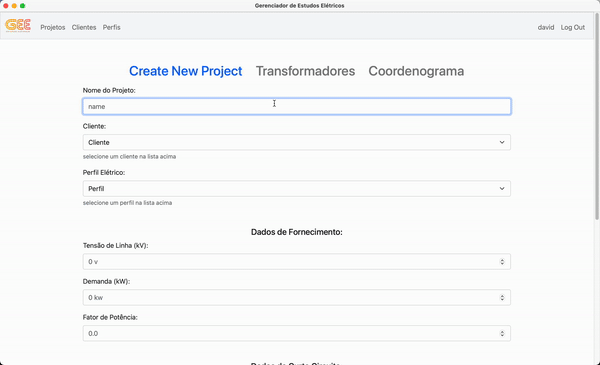

# Gerenciador de Estudos Elétricos

<p align='center'></p>

## Descrição:

Este aplicativo é destinado a profissionais do setor de eletricidade e permite o desenvolvimento de projetos e estudos elétricos relacionados a média e alta tensão.

A partir dos dados de fornecimento o app gera automaticamente a análise relacionada aos pontos ANSI dos transformadores, corrente instantânea de fase e neutro (ANSI 50/50N), corrente de sobrecarga de fase e neutro (ANSI 51/51N) e a curva do coordenograma com todos os pontos plotados, de acordo, mas não limitado, as normas:
- IEC 60255: Measuring relays and protection equipment
- IEEE C57.109: Guide For Liquid-Immersed Transformers Through-Fault-Current Duration
 
<br>

## Estrutura de Diretórios:
- Pasta **static** contém os arquivos estáticos de CSS, Javascript, e imagens;
- Pasta **templates** contém os arquivos HTML, desenvolvidos com Jinja template engine e chart.js para plotar o coordenograma;
- Arquivo **app.py** é o arquivo principal do projeto, usa o framework Flask para o roteamento das paginas e backend;
-  Arquivo **electric.db** é o banco de dados SQLite que armazena todos os dados da aplicação incluindo a autenticação de usuários e dados de projetos. 

<br>


## Instalação:
Primeiramente é necessário ter o python instalado em seu computador.<br>

1. Baixe ou faça o clone do repositório:
```sh
git clone https://github.com/eng-david/GEE_Gerenciador-de-Estudos-Eletricos.git
```

No diretório raiz da aplicação:

2. Crie um ambiente virtual: 
```sh
python -m venv venv
```

3. Ativar o ambiente virtual criado na etapa anterior:<br>

Linux / MacOS:

```sh
. venv/bin/activate
```

Windows:

```sh
. venv\Scripts\activate
```

4. Garantir que o ambiente tem o pip instalado:
```sh
python -m ensurepip
```

5. Instalar as bibliotecas:
```sh
pip install -r requirements.txt
```

6. Iniciar o aplicativo:
```sh
python app.py
```
A partir daí a janela do aplicativo será aberta.

<br>

## Utilização:

No primeiro uso é necessário se registrar com um usuário e senha.

Para criar o primeiro projeto é necessário ter um perfil elétrico, va a pagina **perfis** e crie um novo perfil. O perfil vai definir as constantes de cálculo, depois de preencher todos os campos prossiga para a página **projetos** e crie um novo projeto.

Na criação do projeto é obrigatório selecionar um perfil e informar a tensão, demanda e fator de potência, a seleção de cliente é opcional, caso deseje é possível criar um novo cliente na pagina **clientes**. A definição de correntes de curto circuito é opcional, se não forem informadas não será possível analisar a coordenação das proteções relacionadas a essas correntes.

A próxima pagina define os transformadores do projeto, clique em **novo transformador**, é possível adicionar quantos transformadores desejar, para cada um é obrigatório informar a potência nominal, impedância e tipo. É necessário pelo menos um transformador para prosseguir para a próxima página.

Depois de salvar o projeto, é possível prosseguir para a pagina **coordenograma**, esta pagina mostra as informações compiladas relacionadas a análise elétrica do projeto.

Está incluso o calculo do ponto ANSI de cada transformador, as correntes nominais e de magnetização, a análise relacionada as correntes instantâneas (ANSI 50/50N) e sobrecorrente de fase e neutro (ANSI 51/51N), e a curva do coordenograma da proteção.

<p align='center'></p>

<br>
  
## Tecnologias Utilizadas:
- `Python`
- `Flask Web Framework`
- `Jinja`
- `SQLite`
- `chart.js`
- `Pywebview`


